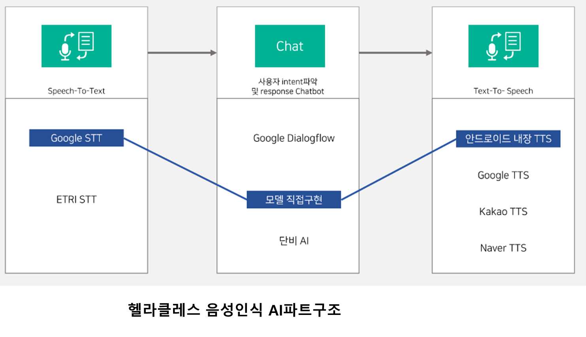
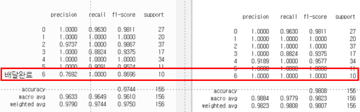
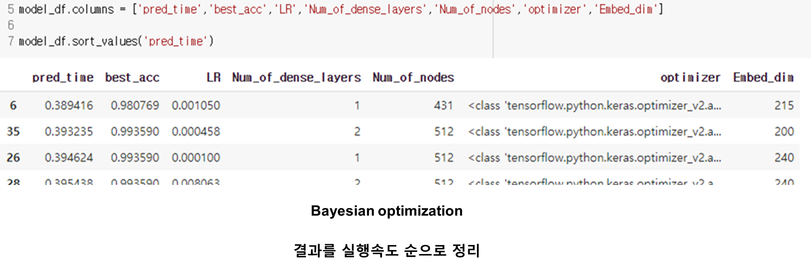
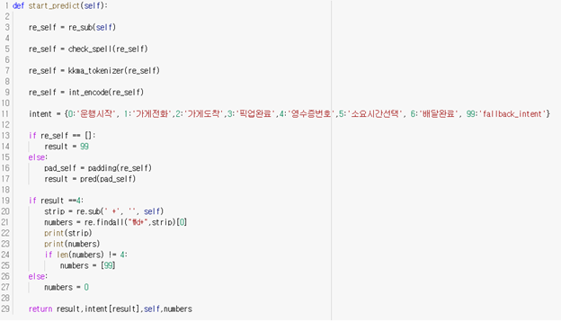

**헬라클레스 AI 수행 보고서**

목차

1. 개요
2. AI 파트 설계 및 구조
3. 수행 내용

4. 느낀 점

5. 참고사이트

진행기간 : 2020.11.14 ~ 2020.12.24

주제 : 음성인식을 통한 배달업무개선과 보험용 운행데이터 수집

팀명 : 헬라클레스

팀원 : 이동규(팀장-AI), 박성준(빅데이터), 홍연하(빅데이터), 이주호(IoT), 이재환(Cloud)

수상기록 : 융복합 프로젝트 경진대회 최우수상

##### 시연영상 링크

- 시연영상
  - https://youtu.be/JEP9UONqxxM
- 모니터링 페이지 영상
  - https://youtu.be/l_wSl5A3OHk
- 발표자료
  - 

**1. AI** **파트 설계 및 구조**

헬라클레스의 AI파트 기술구현은 음성인식 기능에 초점을 맞춰 진행했습니다. 우선 음성인식 기능 구조를 먼저 탐색한 후, 이번 프로젝트 과정속에서 구현 가능한 부분과 API를 사용할 부분으로 나눈 후 아래와 같이 설계 및 구현하였습니다.

STT – Chabot – TTS로 구성되어 있고, STT와 TTS의 경우 한정된 시간과 데이터로는 직접 구현하는 것은 어렵다고 판단, API와 안드로이드 기능을 사용했습니다. 

**2.** **수행 내용**

1. STT는 Google 과 ETRI 두 API를 사용해 성능을 확인한 후 Google STT로 결정하였습니다.

   A.   ETRI STT의 경우 실험한 논문(오현우, 이건녕, 육동석)에 따르면 거리에 따른 인식율이 가장 우수하다 하여 직접 사용해봤으나, 배달관련 단어에 대한 인식률이 Google STT에 비해 부정확한 문제가 있었습니다.

   B.   또, Google STT의 경우 소음제거 기능이 기본적으로 구현되어 있어, 소음이 많은 환경에서 작동해야 하는 서비스 특성에 적합했습니다.

2. Chat bot모델은 RNN에 대한 추가공부가 필요한 상황이라 실제 구현을 해야 할 지 혹은 Google Dialogflow를 이용해 만들지 고민하였고. 우선 Dialogflow를 먼저 구현한 후 모델 직접 구현하기로 결정했습니다.

   A.   Google Dialogflow 구현

   B.   이후 RNN 모델 학습 후 구현

 

3.  Google Dialog flow의 구성내용은 LSTM을 직접 구현했으므로 본 보고서에는 생략하였습니다. Google Dialog flow을 먼저 수행해보면서, chat_bot에 필요한 용어와 흐름에 대한 기초 지식과 구현하려는 서비스에 필요한 기능 등을 정의하는데 많은 도움이 되었습니다.

 

4. Chat bot 모델 구현 전 텍스트 전처리부터 수행했으며 수행단계는 아래와 같습니다.

   A.   직접 녹음한 파일을 STT수행, intent 라벨링을 통해 학습데이터 수집

| Intent       | Label |
| ------------ | ----- |
| 운행시작     | 0     |
| 가게전화     | 1     |
| 가게도착     | 2     |
| 픽업완료     | 3     |
| 영수증번호   | 4     |
| 소요시간선택 | 5     |
| 배달완료     | 6     |

​	B.   먼저 hanspell 라이브러리의 spell_checker를 이용해 맞춤법과 띄어쓰기 검사를 진행

​	C.   학습데이터의 text 중 주문번호 intent에 있는 4자리 주문번호 숫자형식을 정규표현식을 이용해 특수문자로 치환

​	D.   Kkma.pos 형태소 토크나이저를 이용해 형태소로 분리하고, 사용할 형태소만 추출.

​	E.   Train 데이터 단어 중 토크나이저가 제대로 인식하지 못하는 단어들을 확인, vocab사전을 조정 > 			D단계 다시 실행

​	F.   단어 빈도 순으로 word_to_index 저장

​	G.   정수 인코딩

​	H.   zero패딩

​	5.   전처리 된 데이터를 Simple RNN과 LSTM모두 학습시켜 결과를 확인했습니다. 

​	Simple RNN의 경우 val_acc: 0.9872, LSTM의 경우 val_acc: 0.9936으로 LSTM이 더 높은 정확도를 	보였으며, Simple RNN의 경우 6번 intent(배달완료)에 대해 낮은 precision을 보여 LSTM이 더 적합할 것으로 판단하였습니다.

​														<SimpleRNN>									<LSTM>

6. 이후 Bayesian optimization을 이용해 hyper parameter를 tuning하였고, 멘토링 과정 중 음성인식의 속도 관련 피드백을 받아 1건의 테스트데이터를 predict 하는데 걸리는 시간을 추가로 측정하면서 다시 Bayesian optimization을 진행, 45개의 모델 구조를 탐색하였습니다. Call-back을 지정하여 accuracy가 가장 높은 지점이 모델로 저장되게 구현했습니다.

   

   

 

7. 학습을 완료한 모델을 실행용 코드는 학습용과 다르게 단일 문장을 전처리하고 결과를 예측하는 방향으로 함수화해 작성했습니다.

   \-  속도관련 이슈로, 실행용 코드에서는 전체 텍스트 전처리 수행시간의 약 50%를 차지하는 맞춤법 및 띄어쓰기 수정 코드를 삭제하였습니다.

**3.** **느낀 점**

Chatbot을 직접 구현해보면서, 챗봇의 개념과 용어들을 학습할 수 있는 계기가 되었습니다. LSTM 모델을 만들어보고 Bayesian optimization의 코드 구현을 할 수 있어 뿌듯함을 느꼈습니다. 다만, Bayesian optimization이 정확도 개선에 기대한 만큼 도움이 되지 않는 것이 아쉬움으로 남습니다. 학습 데이터 문장의 단어 수가 적어서 가벼운 모델임에도 높은 정확도 달성했는데, 사용자의 intent 혹은 entity 가 좀 더 복잡하게 섞여 있는 문장처리를 시도하면서 Bayesian optimization의 효과를 더 쉽게 확인할 수 있을 것으로 예상됩니다만, Bayesian optimization의 정확한 이해를 위해선 선행되어야할 공부의 깊이가 깊기 때문에, 이 부분을 본 교육과정 이후 진행할 예정입니다.

 프로젝트 팀장으로서, 다른 과정을 학습한 팀원들과 모여서 프로젝트를 수행하는 것이 처음엔 낯설고 어려웠습니다. 다른 팀원들이 수행해 줄 수 있는 범위와 능력이 어느정도 인지 감을 잡기가 어려웠기 때문입니다. 그래서 초반부터 팀원 간 알아가는 과정에 많은 시간과 에너지를 투자하였고, 덕분에 프로젝트 마무리까지 일정에 맞춰서 개발할 수 있었던 것 같습니다.

비전공자로서 막연하고 어려워 보였던 프로그래밍과 AI에 대해 5개월이라는 짧은 기간동안 기대이상으로 효과적으로 학습한 것 같아 좋았습니다. 이번 프로젝트에서 모든 팀원들이 적극적으로 과정에 집중해 스스로 뿌듯한 프로젝트가 된 것 같아 만족스럽습니다.

 

**4.** **참고사이트**

Kkma 형태소 분석기 사전튜닝

https://cromboltz.tistory.com/18

 

STT성능 비교

[http://hiai.co.kr/wp-content/uploads/2019/12/%EB%85%BC%EB%AC%B8%EC%A6%9D%EB%B9%99_2019_15.pdf](http://hiai.co.kr/wp-content/uploads/2019/12/논문증빙_2019_15.pdf)

 

하이퍼 파라미터 튜닝 기법(Bayesian optimization)

http://sanghyukchun.github.io/99/

https://github.com/Hvass-Labs/TensorFlow-Tutorials/blob/master/19_Hyper-Parameters.ipynb

 

챗봇 개념 간단설명

https://www.slideshare.net/JerryJeong2/1-82452746

https://brunch.co.kr/@gentlepie/26

https://brunch.co.kr/@gentlepie/18

 

RNN을 이용한 텍스트분류: 딥러닝을 이용한 자연어 처리 입문

https://wikidocs.net/22933